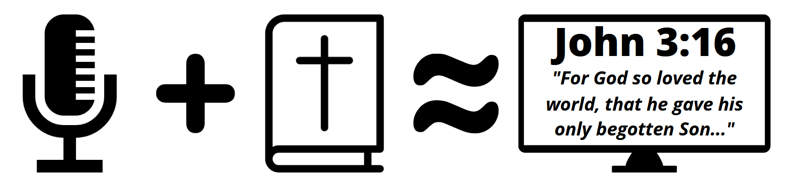

# Sword Drill #

## Overview ##

Sword Drill is a speech to text application that listens for Bible references. When it parses a valid Bible Book/Chapter/Verse reference, it will display it on the screen.

### History ###

This idea of this application was conceptualized prior to 2020, but the COVID pandemic made it more valuable since many churches removed pew Bibles in an attempt to reduce potential transmission of the virus. Although most people have their own Bibles, there are many places where personal Bibles are not very prevelant. Sword Drill can help with this by displaying spoken verses on a screen so all can see.

## Usage ##

This application should work out of the box with the KJV version.
To run, simply double click the executable. If you are promoted, allow the program to access your microphone.

### Limitations ###

Currently the following situations are not handled:

- Parsing of Chapters/Verses over 100 (only affects Psalms)
- Parsing of certain books (Thessalonians, others(?) )

## Development ##

Any help developing this application is appreciated. Pull-requests are welcome.
To get started developing:

1. Clone this repository: `git clone https://github.com/meichthys/sword_drill.git`
2. Install pipenv on your machine: `pip install pipenv`
3. Open the sword_drill cloned repo and run `pipenv install --dev --pre` to install the python requirements.
4. Enter the virtual environment by running `pipenv shell`
5. Run the application by running `python ./src/main.py`

### Voice Recognition Models ###

This application uses a smallest voice recognition model, but other voice recognition models that are compatible with [vosk](https://alphacephei.com/vosk/models) can be used (Note: Currently only English models are supported). To change the model, simply download the model you would like, extract it and save it in the `src` directory with the name of `model`.

## License ##

### The MIT License (MIT) ###

Copyright © 2021 Meichthys

Permission is hereby granted, free of charge, to any person obtaining a copy of this software and associated documentation files (the “Software”), to deal in the Software without restriction, including without limitation the rights to use, copy, modify, merge, publish, distribute, sublicense, and/or sell copies of the Software, and to permit persons to whom the Software is furnished to do so, subject to the following conditions:

The above copyright notice and this permission notice shall be included in all copies or substantial portions of the Software.

THE SOFTWARE IS PROVIDED “AS IS”, WITHOUT WARRANTY OF ANY KIND, EXPRESS OR IMPLIED, INCLUDING BUT NOT LIMITED TO THE WARRANTIES OF MERCHANTABILITY, FITNESS FOR A PARTICULAR PURPOSE AND NONINFRINGEMENT. IN NO EVENT SHALL THE AUTHORS OR COPYRIGHT HOLDERS BE LIABLE FOR ANY CLAIM, DAMAGES OR OTHER LIABILITY, WHETHER IN AN ACTION OF CONTRACT, TORT OR OTHERWISE, ARISING FROM, OUT OF OR IN CONNECTION WITH THE SOFTWARE OR THE USE OR OTHER DEALINGS IN THE SOFTWARE.
